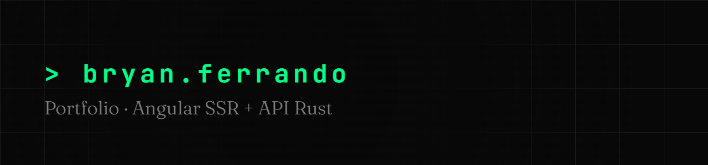

[](https://github.com/BryanFRD/Portfolio/actions/workflows/ci.yml)
[](https://bryan-ferrando.fr)
[](https://github.com/sponsors/BryanFRD)

Site portfolio one-page servi sur [bryan-ferrando.fr](https://bryan-ferrando.fr) : frontend
Angular SSR et API Rust. Design sombre type terminal (JetBrains Mono + Fraunces, accent vert),
issu d'une maquette Figma Make. Bilingue : français sur `/`, anglais sur `/en`.

## Structure

- `frontend/` : Angular 22 + SSR (`@angular/ssr`), one-page rendue côté serveur
- `api/` : API Axum : `GET /api/projects`, `GET /api/csrf`, `POST /api/contact`, `GET /health`
- `ferrflow.json` : versioning FerrFlow par package (`frontend@vX.Y.Z`, `api@vX.Y.Z`)

## Développement

```sh
cd api && cargo run
cd frontend && pnpm start
```

Le dev server Angular proxifie `/api` vers `http://localhost:8080` (`proxy.conf.json`).
Le serveur SSR proxifie aussi `/api` vers `API_URL` (défaut `http://localhost:8080`) pour ses
propres fetchs ; en production, Traefik route `/api` directement vers l'API.

## Contenu

Les projets affichés viennent de `api/assets/projects.json` (slug, catégorie, statut, année,
description, stack, liens, logo, image optionnelle) ; `category`, `status` et `description` sont
localisés `{fr, en}`. Le reste du contenu (hero, stack, timeline, contact) vit dans les
dictionnaires des composants de `frontend/src/app/pages/home/sections/`. L'i18n est maison :
`LocaleService` + objets `Localized{fr, en}` (`frontend/src/app/core/i18n.ts`), locale déduite de
la route, switcher fr/en dans la navbar avec conservation du scroll.

## SEO

- SSR runtime (RenderMode.Server) : la page arrive complète, projets inclus
- Balises meta, Open Graph (`og:image` 1200×630 : `frontend/public/og.png`), canonical, hreflang
  fr/en et JSON-LD gérés par `frontend/src/app/core/seo.ts`
- `robots.txt`, `sitemap.xml` et `llms.txt` servis depuis `frontend/public/`
- Le domaine du site est centralisé dans `frontend/src/app/core/site.ts`
- Lighthouse (mobile, 02/09/2026) : performance 98, accessibilité 100, best practices 100,
  SEO 100

## API : configuration

| Variable | Rôle |
|---|---|
| `PORT` | Port d'écoute (défaut `8080`) |
| `SMTP_HOST`, `SMTP_USERNAME`, `SMTP_PASSWORD` | Relais SMTP pour `POST /api/contact` |
| `CONTACT_FROM`, `CONTACT_TO` | Expéditeur et destinataire des messages |

Le formulaire de contact est protégé par un token CSRF en double soumission : `GET /api/csrf`
pose un cookie HttpOnly SameSite=Strict et renvoie le token, que `POST /api/contact` exige dans
l'en-tête `X-Csrf-Token`. Sans configuration SMTP complète (les cinq variables), l'endpoint
répond `503`. Le `Reply-To` des mails est l'adresse saisie dans le formulaire.

## CI / Release

- `ci.yml` : checks frontend (tests + build) et api (fmt, clippy, tests) puis release FerrFlow sur `main`
- FerrFlow calcule les versions depuis les commits conventionnels (versionnement
  `calver-short-seq`) et publie les tags `frontend@vX.Y.Z` / `api@vX.Y.Z`
- `docker.yml` : à la publication d'une release, build de l'image du package concerné via la
  reusable workflow de l'org (buildah, scan Trivy bloquant sur CRITICAL/HIGH, signature cosign)
  et push vers `ghcr.io/bryanfrd/portfolio/{frontend,api}` (`<version>`, `<major.minor>`,
  `latest`)

## Déploiement

GitOps via FerrLabs/Homelab (`kubernetes/apps/base/portfolio`) : deux Deployments (web SSR et
api), Flux image automation qui bump les tags d'images à chaque release, deux Ingress Traefik
sur `bryan-ferrando.fr` (`/` vers le web, `/api` vers l'API) avec compression, rate limiting
(30 req/s global, 5 req/s sur `/api`) et headers de sécurité (HSTS preload, nosniff, frameDeny).
Les images sont publiques, donc aucun secret de registre : seul `portfolio-smtp` (les cinq
variables SMTP ci-dessus) est nécessaire côté cluster.
